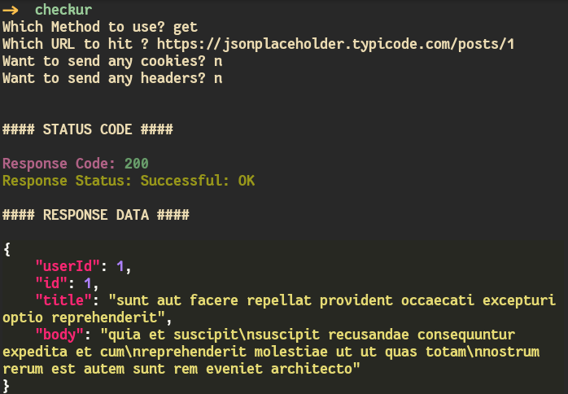
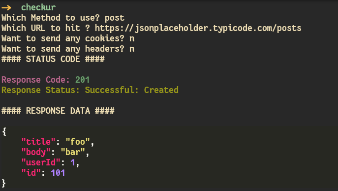
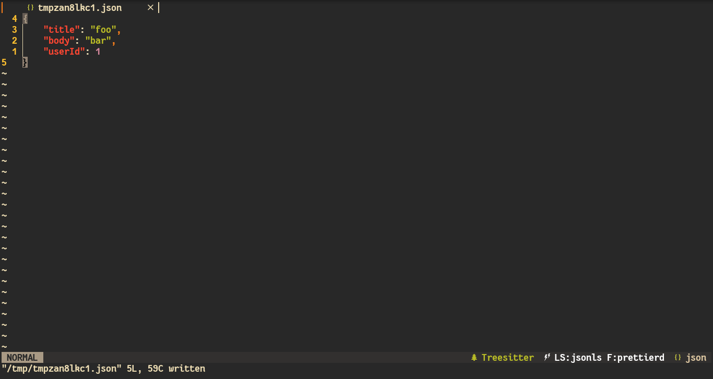
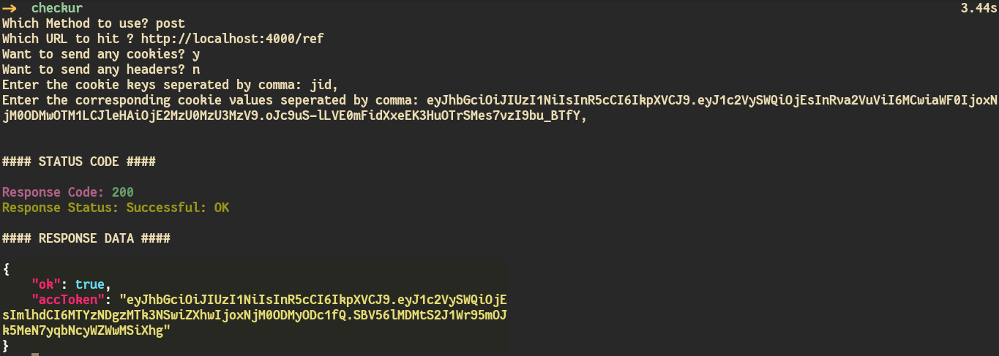
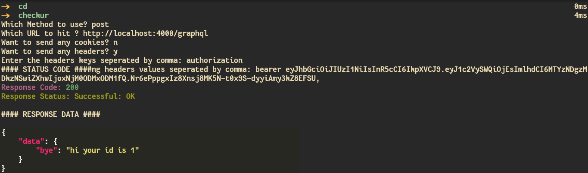

## Check ur requests

> **Minimal terminal script to hit servers from terminal**

### DEMO

**GET REQUEST**



**POST REQUEST**



> **Opens in a vim buffer to edit post body**



**COOKIES**

> **Send Multiple cookies seperated by comma**



**HEADERS**

> **Send Multiple headers seperated by comma**



### Dependencies

> **checkur depends on rich for pretty priniting of response**

```sh
pip install rich
```

> **checkur depends on a terminal editor for editing post body**

```
Install neovim or vim or any terminal editor of your choice
```

### Installation

```
git clone https://github.com/glowfi/check-ur-requests
cd check-ur-requests
chmod +x ./checkur.py
./checkur.py
```

### Details

**Methods avalaible : Get,Post,Put,Delete,Patch**
